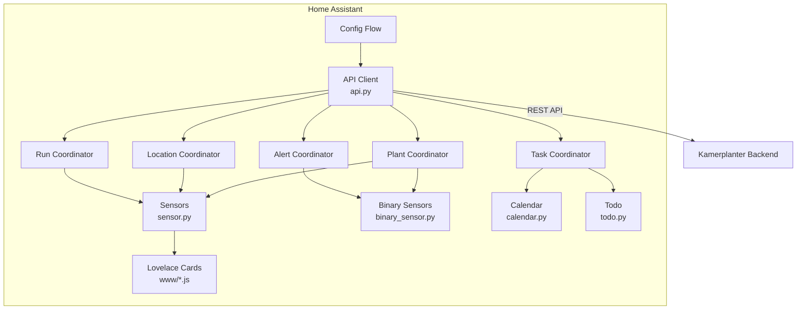

# Architektur

## Uebersicht

---

## Komponenten

### API Client (`api.py`)

- Aiohttp-basierter HTTP-Client gegen das Kamerplanter-Backend
- Tenant-scoped Endpunkte via `_tenant_prefix`
- Fehlerbehandlung mit `KamerplanterApiError`

### Coordinators (`coordinator.py`)

Fuenf `DataUpdateCoordinator`-Instanzen mit unabhaengigen Polling-Intervallen:

| Coordinator | Daten | Standard-Intervall |
|-------------|-------|-------------------|
| **Plant** | Pflanzen, Phasen, Dosierungen, VPD/EC-Sollwerte | 300s |
| **Location** | Standorte, Tanks, Fuellstaende | 300s |
| **Run** | Pflanzdurchlaeufe, Run-Status, Pflanzenanzahl | 300s |
| **Alert** | Ueberfaellige Aufgaben, Sensor-Status | 60s |
| **Task** | Anstehende Aufgaben | 300s |

!!! info "Warum 5 Coordinators?"
    Durch die Trennung koennen zeitkritische Alerts (60s) haeufiger gepollt werden als Stammdaten (300s). Jeder Coordinator hat seinen eigenen Fehler-Counter und Recovery-Mechanismus.

### Entity-Plattformen

| Datei | Plattform | Entities | Coordinator(s) |
|-------|-----------|----------|----------------|
| `sensor.py` | `sensor` | Pflanzen, Runs, Standorte, Tanks, Server | Plant, Location, Run |
| `binary_sensor.py` | `binary_sensor` | Attention, Care, Sensor-Status | Alert |
| `calendar.py` | `calendar` | Phasen, Aufgaben | Plant, Task |
| `todo.py` | `todo` | Aufgabenliste | Task |
| `button.py` | `button` | Refresh All | — |

### Custom Lovelace Cards (`www/`)

5 Vanilla-JS-Cards (HTMLElement + Shadow DOM), auto-registriert beim Setup:

- `kamerplanter-plant-card.js`
- `kamerplanter-mix-card.js`
- `kamerplanter-tank-card.js`
- `kamerplanter-care-card.js`
- `kamerplanter-houseplant-card.js`

---

## Style Guide

Alle Code-Aenderungen muessen dem Style Guide folgen: [`spec/style-guides/HA-INTEGRATION.md`](https://github.com/nolte/kamerplanter-ha/blob/main/spec/style-guides/HA-INTEGRATION.md)

Wichtigste Patterns:

- **runtime_data** statt `hass.data[DOMAIN]`
- **EntityDescription** statt individueller Entity-Klassen
- **Entity-IDs** werden von HA generiert, nie manuell gesetzt
- **icons.json** statt `_attr_icon`
- **DeviceInfo** mit `via_device` zum Server-Hub
