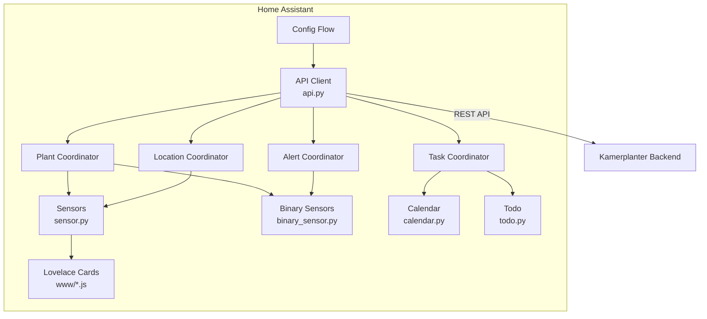

# Architektur

## Uebersicht

## Komponenten

### API Client (`api.py`)

- Aiohttp-basierter HTTP-Client gegen das Kamerplanter-Backend
- Tenant-scoped Endpunkte via `_tenant_prefix`
- Fehlerbehandlung mit `KamerplanterApiError`

### Coordinators (`coordinator.py`)

Vier `DataUpdateCoordinator`-Instanzen mit unabhaengigen Polling-Intervallen:

| Coordinator | Daten | Standard-Intervall |
|-------------|-------|-------------------|
| Plant | Pflanzen, Runs, Phasen, Dosierungen | 300s |
| Location | Standorte, Tanks | 300s |
| Alert | Ueberfaellige Aufgaben, Sensor-Status | 60s |
| Task | Anstehende Aufgaben | 300s |

### Entity-Plattformen

| Datei | Plattform | Entities |
|-------|-----------|----------|
| `sensor.py` | `sensor` | Pflanzen, Runs, Standorte, Tanks, Server |
| `binary_sensor.py` | `binary_sensor` | Attention, Care, Sensor-Status |
| `calendar.py` | `calendar` | Phasen, Aufgaben |
| `todo.py` | `todo` | Aufgabenliste |
| `button.py` | `button` | Refresh All |

### Custom Lovelace Cards (`www/`)

5 Vanilla-JS-Cards (HTMLElement + Shadow DOM), auto-registriert beim Setup:

- `kamerplanter-plant-card.js`
- `kamerplanter-mix-card.js`
- `kamerplanter-tank-card.js`
- `kamerplanter-care-card.js`
- `kamerplanter-houseplant-card.js`

## Style Guide

Alle Code-Aenderungen muessen dem Style Guide folgen: `spec/style-guides/HA-INTEGRATION.md`

Wichtigste Patterns:

- **runtime_data** statt `hass.data[DOMAIN]`
- **EntityDescription** statt individueller Entity-Klassen
- **Entity-IDs** werden von HA generiert, nie manuell gesetzt
- **icons.json** statt `_attr_icon`
- **DeviceInfo** mit `via_device` zum Server-Hub
