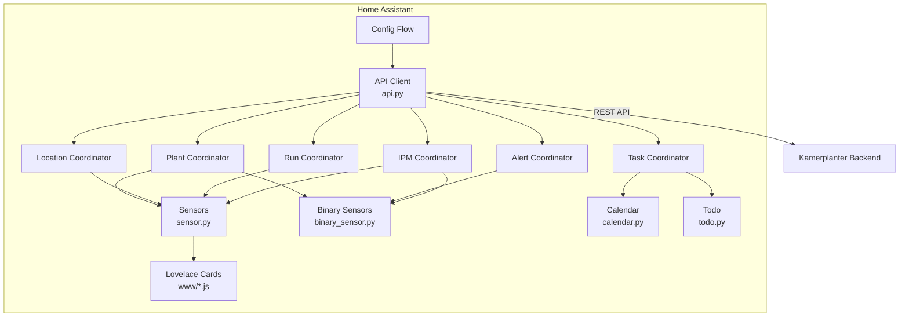

# Architektur

## Übersicht

```mermaid
flowchart TB
    subgraph HA["Home Assistant"]
        CF["Config Flow"] --> API["API Client\napi.py"]
        API --> C1["Plant Coordinator"]
        API --> C2["Location Coordinator"]
        API --> C3["Run Coordinator"]
        API --> C4["Alert Coordinator"]
        API --> C5["Task Coordinator"]
        API --> C6["IPM Coordinator"]
        C1 --> S["Sensors\nsensor.py"]
        C1 --> BS["Binary Sensors\nbinary_sensor.py"]
        C2 --> S
        C3 --> S
        C4 --> BS
        C6 --> S
        C6 --> BS
        C5 --> CAL["Calendar\ncalendar.py"]
        C5 --> TODO["Todo\ntodo.py"]
        S --> CARDS["Lovelace Cards\nwww/*.js"]
    end
    API -->|REST API| KP["Kamerplanter Backend"]
```

---

## Komponenten

Die Daten fließen in eine Richtung. Die Kette hat vier Stufen:

- Der API-Client holt die Daten vom Backend.
- Die Coordinators planen diese Abrufe.
- Die Entity-Plattformen stellen die Daten als HA-Entities bereit.
- Die Lovelace-Cards zeigen diese Entities an.

### API Client (`api.py`)

- aiohttp-basierter HTTP-Client gegen das Kamerplanter-Backend
- Tenant-scoped Endpunkte via `_tenant_prefix`
- Fehlerbehandlung mit `KamerplanterApiError`

### Coordinators (`coordinator.py`)

Sechs `DataUpdateCoordinator`-Instanzen, jede mit eigenem Intervall. Der Coordinator ist [HAs eingebauter Polling-Manager](https://developers.home-assistant.io/docs/integration_fetching_data/):

| Coordinator | Daten | Standard-Intervall |
|-------------|-------|-------------------|
| **Plant** | Pflanzen, Phasen, Dosierungen | 300s |
| **Location** | Standorte, Tanks, Füllstände | 300s |
| **Run** | Pflanzdurchläufe, Run-Status, Pflanzenanzahl | 300s |
| **Alert** | Überfällige Aufgaben, Sensor-Status | 60s |
| **Task** | Anstehende Aufgaben | 300s |
| **IPM** | Schädlingsdruck, Karenz, Erntesicherheit | 120s |

!!! info "Warum 6 Coordinators?"
    Die Coordinators sind getrennt. So fragt die Integration zeitkritische Alerts (60s) häufiger ab als Stammdaten (300s). Jeder Coordinator hat einen eigenen Fehler-Counter und eine eigene Recovery.

### Entity-Plattformen

| Datei | Plattform | Entities | Coordinators |
|-------|-----------|----------|----------------|
| `sensor.py` | `sensor` | Pflanzen, Runs, Standorte, Tanks, Server | Plant, Location, Run, IPM |
| `binary_sensor.py` | `binary_sensor` | Attention, Care, Sensor-Status | Alert, IPM |
| `calendar.py` | `calendar` | Phasen, Aufgaben | Plant, Task |
| `todo.py` | `todo` | Aufgabenliste | Task |
| `button.py` | `button` | Refresh All | — |

### Custom Lovelace Cards (`www/`)

5 Vanilla-JS-Cards (HTMLElement + Shadow DOM), auto-registriert beim Setup:

- `kamerplanter-plant-card.js`
- `kamerplanter-mix-card.js`
- `kamerplanter-tank-card.js`
- `kamerplanter-care-card.js`
- `kamerplanter-houseplant-card.js`

---

## Styleguide

Alle Codeänderungen folgen dem Styleguide: [`spec/style-guides/HA-INTEGRATION.md`](https://github.com/nolte/kamerplanter-ha/blob/main/spec/style-guides/HA-INTEGRATION.md)

Wichtigste Patterns:

- **runtime_data** statt `hass.data[DOMAIN]`
- **EntityDescription** statt individueller Entity-Klassen
- **Entity-IDs** werden von HA generiert, nie manuell gesetzt
- **icons.json** statt `_attr_icon`
- **DeviceInfo** mit `via_device` zum Server-Hub
