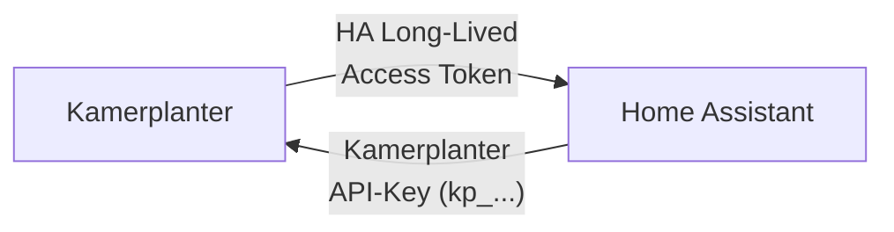

# Einrichtung

## Voraussetzungen: Bidirektionaler API-Zugriff

Fuer eine vollstaendige Integration muessen **beide Systeme gegenseitig API-Zugriff** haben:

| Richtung | Token | Wozu | Wo erstellen |
|----------|-------|------|-------------|
| **HA → Kamerplanter** | Kamerplanter API-Key (`kp_`-Prefix) | HA liest Pflanzendaten, Tankwerte, Aufgaben | Kamerplanter: **Einstellungen** > **API-Keys** |
| **Kamerplanter → HA** | HA Long-Lived Access Token | Kamerplanter liest Sensordaten, steuert Aktoren | Home Assistant: **Profil** > **Long-Lived Access Tokens** |

!!! warning "Beide Tokens erforderlich"
    Ohne den **Kamerplanter API-Key** kann die HA-Integration keine Daten abfragen. Ohne den **HA Access Token** kann Kamerplanter keine Sensordaten aus Home Assistant lesen und keine Aktoren steuern. Fuer einen reinen Lese-Betrieb (nur HA-Dashboard) reicht der Kamerplanter API-Key allein.

### Tokens einrichten

**1. Kamerplanter API-Key erstellen** (fuer HA → Kamerplanter):

1. In Kamerplanter: **Einstellungen** > **API-Keys** > **Neuer Key**
2. Den generierten Key (`kp_...`) kopieren
3. In Home Assistant: Bei der Kamerplanter-Integration im Config Flow eingeben

**2. HA Access Token erstellen** (fuer Kamerplanter → HA):

1. In Home Assistant: **Profil** (unten links) > **Long-Lived Access Tokens** > **Token erstellen**
2. Den Token kopieren
3. In Kamerplanter: **Einstellungen** > **Home Assistant** > URL und Token eintragen

---

## Config Flow

Nach der Installation fuehrt ein 4-Schritte-Assistent durch die Konfiguration:

### Schritt 1: Kamerplanter-URL

Gib die URL deiner Kamerplanter-Instanz ein:

- Lokal: `http://raspberry:8000` oder `http://192.168.1.50:8000`
- Extern: `https://kamerplanter.example.com`

Die Integration prueft die Erreichbarkeit automatisch via `/api/health`.

### Schritt 2: Authentifizierung

| Modus | Beschreibung |
|-------|-------------|
| **Light-Modus** | Keine Authentifizierung noetig |
| **API-Key** | API-Schluessel mit `kp_`-Prefix eingeben (empfohlen) |
| **Login** | Benutzername und Passwort als Fallback |

### Schritt 3: Tenant auswaehlen

Bei Multi-Tenant-Betrieb (z.B. Gemeinschaftsgarten) den gewuenschten Tenant aus der Liste waehlen. Bei Einzelnutzern wird dieser Schritt uebersprungen.

### Schritt 4: Entities konfigurieren

Waehle aus, welche Pflanzen, Standorte und Tanks als HA-Entities angelegt werden sollen. Per Default werden alle verfuegbaren Entities erstellt.

---

## Polling-Intervalle

Konfigurierbar unter **Einstellungen** > **Integrationen** > **Kamerplanter** > **Konfigurieren**:

| Datentyp | Standard | Minimum | Beschreibung |
|----------|----------|---------|-------------|
| Pflanzen | 300s | 120s | Pflanzen, Phasen, Dosierungen |
| Standorte | 300s | 120s | Standorte, Tanks, Runs |
| Alarme | 60s | 30s | Ueberfaellige Aufgaben, Sensor offline |
| Aufgaben | 300s | 120s | Anstehende Aufgaben |
