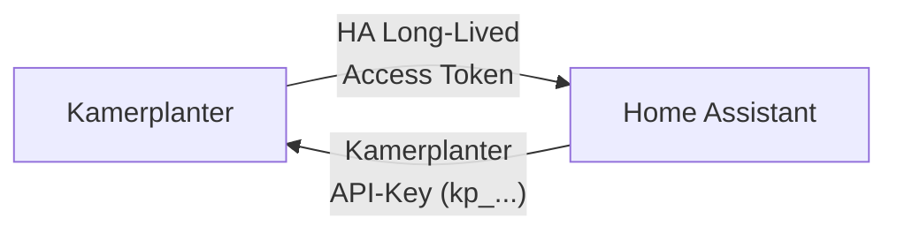

# Einrichtung

!!! note "Bevor du beginnst"
    Diese Anleitung setzt zwei Dinge voraus:

    1. Eine laufende und erreichbare Kamerplanter-Backend-Instanz.
    2. Netzwerkzugang vom Home-Assistant-Host zur Backend-URL.

## Voraussetzungen: Bidirektionaler API-Zugriff

Für eine vollständige Integration brauchen **beide Systeme gegenseitigen API-Zugriff**:

```mermaid
flowchart LR
    KP["Kamerplanter"] -- "HA Long-Lived\nAccess Token" --> HA["Home Assistant"]
    HA -- "Kamerplanter\nAPI-Key (kp_...)" --> KP
```

| Richtung | Token | Wozu | Wo erstellen |
|----------|-------|------|-------------|
| **HA → Kamerplanter** | Kamerplanter API-Key (`kp_`-Prefix) | HA liest Pflanzendaten, Tankwerte, Aufgaben | Kamerplanter: **Einstellungen** > **API-Keys** |
| **Kamerplanter → HA** | HA Long-Lived Access Token | Kamerplanter liest Sensordaten, steuert Aktoren | Home Assistant: **Profil** > **Long-Lived Access Tokens** |

!!! warning "Beide Tokens erforderlich"
    Die HA-Integration braucht den **Kamerplanter API-Key**, um Daten abzufragen. Kamerplanter braucht den **HA Access Token**, um Sensordaten aus Home Assistant zu lesen. Mit demselben Token steuert Kamerplanter außerdem Aktoren. Willst du nur lesen (nur HA-Dashboard), reicht der Kamerplanter API-Key allein.

### Tokens einrichten

=== "Kamerplanter API-Key (HA → Kamerplanter)"

    1. In Kamerplanter: **Einstellungen** > **API-Keys** > neuer Key
    2. Den generierten Key (`kp_...`) kopieren
    3. In Home Assistant: Bei der Kamerplanter-Integration im Config Flow eingeben

=== "HA Access Token (Kamerplanter → HA)"

    1. In Home Assistant: **Profil** (unten links) > **Long-Lived Access Tokens** > **Token erstellen**
    2. Den Token kopieren
    3. In Kamerplanter: **Einstellungen** > **Home Assistant** > URL und Token eintragen

---

## Config Flow (Einrichtungsassistent)

Nach der Installation führt ein 2-Schritte-Assistent durch die Konfiguration:

### Schritt 1: Kamerplanter-URL und API-Key

Gib die URL deiner Kamerplanter-Instanz und den API-Key zusammen ein:

| Beispiel | URL |
|----------|-----|
| Lokal | `http://raspberry:8000` oder `http://192.168.1.50:8000` |
| Extern | `https://kamerplanter.example.com` |

Den API-Key (`kp_`-Prefix) im selben Schritt eintragen. Im Light-Modus ist der Key optional.

!!! info "Automatischer Health-Check & Modus-Erkennung"
    Die Integration prüft die Erreichbarkeit automatisch via `/api/health`. Dabei erkennt sie auch, ob das Backend im Light- oder Full-Modus läuft. Ein separater Auth-Auswahl-Schritt entfällt.

### Schritt 2: Tenant (Benutzerbereich) auswählen

Bei Multi-Tenant-Betrieb (z.B. Gemeinschaftsgarten) den gewünschten Tenant aus der Liste wählen. Bei Einzelnutzern überspringt HA diesen Schritt.

---

## Erneute Authentifizierung & Neukonfiguration

Die Integration unterstützt zwei Korrektur-Flows, erreichbar über **Einstellungen** > **Integrationen** > **Kamerplanter**:

=== "Reauthentifizierung"

    Wenn dein API-Key abgelaufen oder widerrufen wurde, zeigt HA die Integration als fehlerhaft an. Klicke auf **Erneut authentifizieren** und gib einen neuen API-Key ein.

    !!! tip "Wann wird Reauth ausgelöst?"
        HA erkennt automatisch, wenn die API mit `401 Unauthorized` antwortet, und löst dann die Reauth-Aufforderung aus.

=== "Reconfigure"

    Ändere die Server-URL, z.B. nach einem Umzug des Backends auf eine neue Adresse. Klicke auf **Konfigurieren** > **Server-URL ändern**.

---

## Polling-Intervalle

Konfigurierbar unter **Einstellungen** > **Integrationen** > **Kamerplanter** > **Konfigurieren**:

| Coordinator | Standard | Minimum | Daten |
|-------------|----------|---------|-------|
| **Plant** | 300s | 120s | Pflanzen, Phasen, Dosierungen (steuert auch den Run-Coordinator) |
| **Location** | 300s | 120s | Standorte, Tanks, Füllstände |
| **Alert** | 60s | 30s | Überfällige Aufgaben, Sensor offline |
| **Task** | 300s | 120s | Anstehende Aufgaben |
| **IPM** | 120s | 60s | Schädlingsdruck, Karenz, Erntesicherheit |

!!! tip "Warnungen häufiger abrufen"
    Der Alert-Coordinator hat bewusst ein kürzeres Standard-Intervall (60s), damit zeitkritische Benachrichtigungen schneller ankommen.
