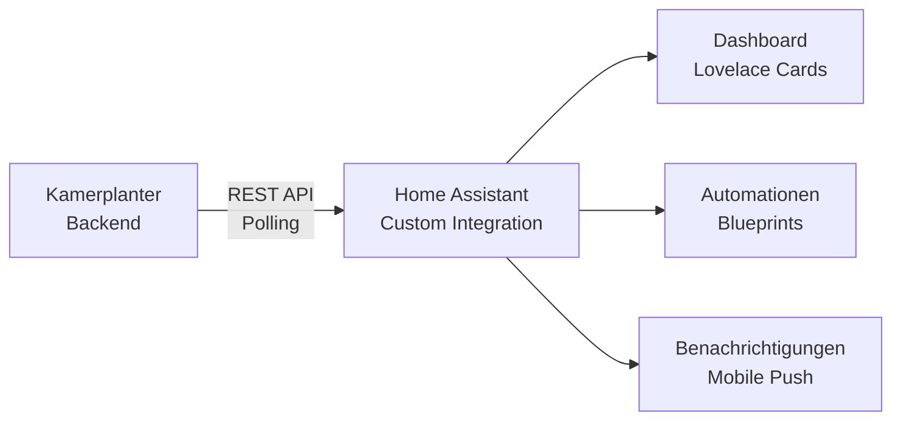

# Kamerplanter Home Assistant Integration

Kamerplanter laesst sich ueber eine **Custom Integration** in Home Assistant einbinden. Alle Pflanzendaten, Tankwerte, Aufgaben und Kalendereintraege erscheinen als native HA-Entities und koennen in Dashboards, Automationen und Benachrichtigungen genutzt werden.

| Aspekt | Details |
|--------|---------|
| **Repository** | [nolte/kamerplanter-ha](https://github.com/nolte/kamerplanter-ha) |
| **Installation** | HACS (Home Assistant Community Store) oder manuell |
| **Kommunikation** | REST API Polling gegen Kamerplanter-Backend |
| **Authentifizierung** | API-Key (`kp_`-Prefix) oder Light-Modus (ohne Auth) |
| **HA-Mindestversion** | Home Assistant Core 2024.1+ |

## Features

- **Pflanzen-Monitoring** — Wachstumsphasen, Tage in Phase, naechste Phase, Naehrplanprofil
- **Naehrstoff-Dosierungen** — pro Kanal als Sensor-Attribute (ml/L), Dashboard-ready
- **Tank-Management** — Fuellstand, Loesungsalter, EC/pH via HA-Services
- **Standort-Uebersicht** — aktive Runs und Pflanzenanzahl pro Zelt/Raum/Beet
- **Aufgaben-Tracking** — Todo-Entity, ueberfaellige Aufgaben, Kalender-Events
- **Pflege-Erinnerungen** — Binary Sensors fuer ueberfaellige Pflege, Events fuer Benachrichtigungen
- **5 Custom Lovelace Cards** — Plant, Mix, Tank, Care, Houseplant Card (auto-registriert)
- **Services** — Tank fuellen, Kanal giessen, Pflege bestaetigen, Daten aktualisieren

## Weiter

- [Installation](guides/installation.md) — HACS oder manuell installieren
- [Einrichtung](guides/setup.md) — Config Flow und Token-Austausch
- [Entities](guides/entities.md) — Alle verfuegbaren Sensoren und Entities
- [Automationen](guides/automations.md) — Beispiel-Automationen und Jinja2-Templates
- [Lovelace Cards](guides/lovelace-cards.md) — Custom Cards konfigurieren
- [Services](guides/services.md) — HA-Services der Integration

## Kamerplanter-Hauptprojekt

Die HA-Integration ist ein eigenstaendiges Repository. Das Kamerplanter-Backend und die vollstaendige Dokumentation findest du unter:

- [Kamerplanter Dokumentation](https://nolte.github.io/kamerplanter/)
- [Kamerplanter Repository](https://github.com/nolte/kamerplanter)
