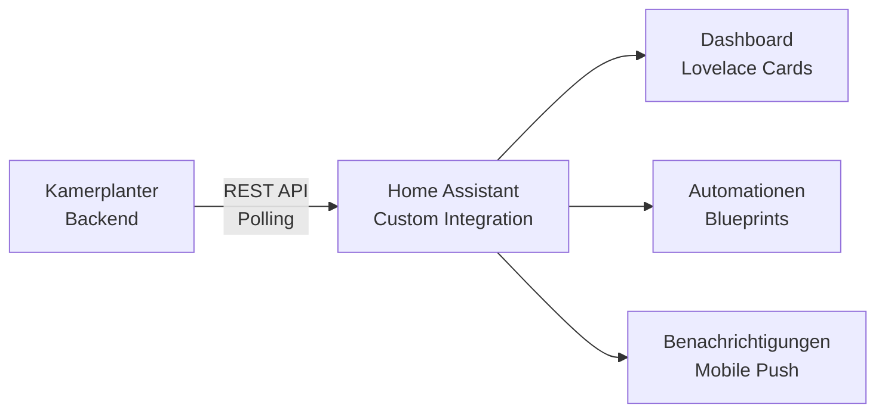

# Kamerplanter Home Assistant Integration

Kamerplanter lässt sich über eine **Custom Integration** in Home Assistant einbinden. Alle Pflanzendaten, Tankwerte, Aufgaben und Kalendereinträge erscheinen als native HA-Entities und können in Dashboards, Automationen und Benachrichtigungen genutzt werden.

```mermaid
flowchart LR
    KP["Kamerplanter\nBackend"] -->|REST API\nPolling| HA["Home Assistant\nCustom Integration"]
    HA --> D["Dashboard\nLovelace Cards"]
    HA --> A["Automationen\nBlueprints"]
    HA --> N["Benachrichtigungen\nMobile Push"]
```

| Aspekt | Details |
|--------|---------|
| **Repository** | [nolte/kamerplanter-ha](https://github.com/nolte/kamerplanter-ha) |
| **Installation** | HACS (Home Assistant Community Store) oder manuell |
| **Kommunikation** | REST API Polling gegen Kamerplanter-Backend |
| **Authentifizierung** | API-Key (`kp_`-Prefix) oder Light-Modus (ohne Auth) |
| **HA-Mindestversion** | Home Assistant Core 2024.1+ |

## Features

- :seedling: **Pflanzen-Monitoring** — Wachstumsphasen, Tage in Phase, VPD/EC-Sollwerte, nächste Phase, Nährplanprofil
- :test_tube: **Nährstoff-Dosierungen** — pro Kanal als Sensor-Attribute (ml/L), direkt für Dashboards nutzbar
- :potable_water: **Tank-Management** — Füllstand, Lösungsalter, EC/pH via HA-Services
- :house: **Standort-Übersicht** — aktive Runs und Pflanzenanzahl pro Zelt/Raum/Beet
- :ballot_box_with_check: **Aufgaben-Tracking** — Todo-Entity, überfällige Aufgaben, Kalender-Events
- :bell: **Pflege-Erinnerungen** — Binary Sensors für überfällige Pflege, Events für Benachrichtigungen
- :art: **5 Custom Lovelace Cards** — Plant, Mix, Tank, Care, Houseplant Card (auto-registriert)
- :gear: **5 Services** — Tank füllen, Kanal gießen, Pflege bestätigen, Daten aktualisieren, Cache leeren

!!! info "5 unabhängige Polling-Zeitpläne"
    Die Integration nutzt **5 separate Polling-Zeitpläne** (Plant, Location, Run, Alert, Task) — jeder einzeln konfigurierbar. Zeitkritische Alerts kommen so schneller an als Stammdaten.

## Weiter

- [Installation](guides/installation.md) — HACS oder manuell installieren
- [Einrichtung](guides/setup.md) — Config Flow, Token-Austausch, Reauth & Reconfigure
- [Entities](guides/entities.md) — Alle verfügbaren Sensoren und Entities
- [Automationen](guides/automations.md) — Beispiel-Automationen und Jinja2-Templates
- [Lovelace Cards](guides/lovelace-cards.md) — Custom Cards konfigurieren
- [Services](guides/services.md) — HA-Services der Integration

## Kamerplanter-Hauptprojekt

Die HA-Integration ist ein eigenständiges Repository. Das Kamerplanter-Backend und die vollständige Dokumentation findest du unter:

- [Kamerplanter Dokumentation](https://nolte.github.io/kamerplanter/)
- [Kamerplanter Repository](https://github.com/nolte/kamerplanter)
