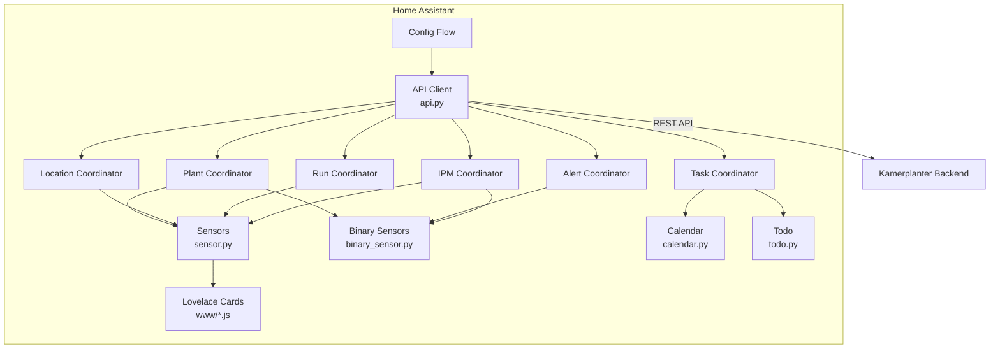

# Architecture

## Overview

```mermaid
flowchart TB
    subgraph HA["Home Assistant"]
        CF["Config Flow"] --> API["API Client\napi.py"]
        API --> C1["Plant Coordinator"]
        API --> C2["Location Coordinator"]
        API --> C3["Run Coordinator"]
        API --> C4["Alert Coordinator"]
        API --> C5["Task Coordinator"]
        API --> C6["IPM Coordinator"]
        C1 --> S["Sensors\nsensor.py"]
        C1 --> BS["Binary Sensors\nbinary_sensor.py"]
        C2 --> S
        C3 --> S
        C4 --> BS
        C6 --> S
        C6 --> BS
        C5 --> CAL["Calendar\ncalendar.py"]
        C5 --> TODO["Todo\ntodo.py"]
        S --> CARDS["Lovelace Cards\nwww/*.js"]
    end
    API -->|REST API| KP["Kamerplanter Backend"]
```

---

## Components

Data flows in one direction. The chain has four stages:

- The API client fetches from the backend.
- The coordinators schedule those fetches.
- The entity platforms expose the polled data as HA entities.
- The Lovelace cards render those entities.

### API Client (`api.py`)

- aiohttp-based HTTP client against the Kamerplanter backend
- Tenant-scoped endpoints via `_tenant_prefix`
- Error handling with `KamerplanterApiError`

### Coordinators (`coordinator.py`)

Six `DataUpdateCoordinator` ([HA's built-in polling manager](https://developers.home-assistant.io/docs/integration_fetching_data/)) instances with independent polling intervals:

| Coordinator | Data | Default Interval |
|-------------|------|-----------------|
| **Plant** | Plants, phases, dosages | 300s |
| **Location** | Locations, tanks, fill levels | 300s |
| **Run** | Planting runs, run status, plant counts | 300s |
| **Alert** | Overdue tasks, sensor status | 60s |
| **Task** | Pending tasks | 300s |
| **IPM** | Pest pressure, waiting period, harvest safety | 120s |

!!! info "Why 6 coordinators?"
    Separating concerns lets the integration poll time-critical alerts (60s) more frequently than master data (300s). Each coordinator has its own error counter and recovery mechanism.

### Entity Platforms

| File | Platform | Entities | Coordinators |
|------|----------|----------|----------------|
| `sensor.py` | `sensor` | Plants, runs, locations, tanks, server | Plant, Location, Run, IPM |
| `binary_sensor.py` | `binary_sensor` | Attention, care, sensor status | Alert, IPM |
| `calendar.py` | `calendar` | Phases, tasks | Plant, Task |
| `todo.py` | `todo` | Task list | Task |
| `button.py` | `button` | Refresh all | — |

### Custom Lovelace Cards (`www/`)

5 vanilla JS cards (HTMLElement + Shadow DOM), auto-registered on setup:

- `kamerplanter-plant-card.js`
- `kamerplanter-mix-card.js`
- `kamerplanter-tank-card.js`
- `kamerplanter-care-card.js`
- `kamerplanter-houseplant-card.js`

---

## Style Guide

All code changes must follow the style guide: [`spec/style-guides/HA-INTEGRATION.md`](https://github.com/nolte/kamerplanter-ha/blob/main/spec/style-guides/HA-INTEGRATION.md)

Key patterns:

- **runtime_data** instead of `hass.data[DOMAIN]`
- **EntityDescription** instead of individual entity classes
- **Entity IDs** — HA generates entity IDs, never set them manually
- **icons.json** instead of `_attr_icon`
- **DeviceInfo** with `via_device` linking to server hub
