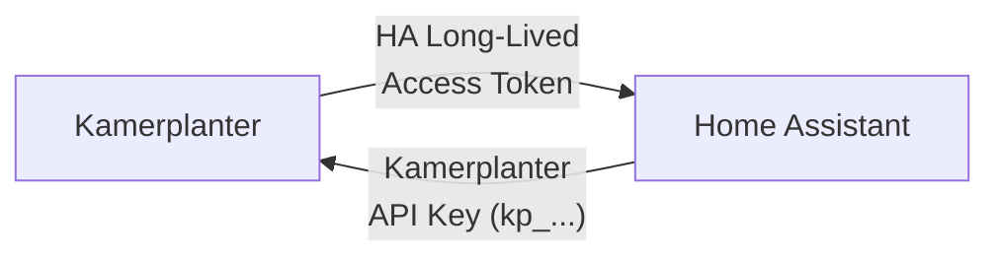

# Setup

## Prerequisites: Bidirectional API Access

For a full integration, **both systems need mutual API access**:

| Direction | Token | Purpose | Where to create |
|-----------|-------|---------|----------------|
| **HA → Kamerplanter** | Kamerplanter API key (`kp_` prefix) | HA reads plant data, tank values, tasks | Kamerplanter: **Settings** > **API Keys** |
| **Kamerplanter → HA** | HA Long-Lived Access Token | Kamerplanter reads sensor data, controls actuators | Home Assistant: **Profile** > **Long-Lived Access Tokens** |

!!! warning "Both tokens required"
    Without the **Kamerplanter API key**, the HA integration cannot query data. Without the **HA Access Token**, Kamerplanter cannot read sensor data from Home Assistant or control actuators. For read-only use (HA dashboard only), the Kamerplanter API key alone is sufficient.

### Setting Up Tokens

**1. Create Kamerplanter API key** (for HA → Kamerplanter):

1. In Kamerplanter: **Settings** > **API Keys** > **New Key**
2. Copy the generated key (`kp_...`)
3. In Home Assistant: Enter during the Kamerplanter integration config flow

**2. Create HA Access Token** (for Kamerplanter → HA):

1. In Home Assistant: **Profile** (bottom left) > **Long-Lived Access Tokens** > **Create Token**
2. Copy the token
3. In Kamerplanter: **Settings** > **Home Assistant** > Enter URL and token

---

## Config Flow

After installation, a 4-step wizard guides you through configuration:

### Step 1: Kamerplanter URL

Enter the URL of your Kamerplanter instance:

- Local: `http://raspberry:8000` or `http://192.168.1.50:8000`
- External: `https://kamerplanter.example.com`

The integration automatically checks reachability via `/api/health`.

### Step 2: Authentication

| Mode | Description |
|------|------------|
| **Light mode** | No authentication required |
| **API key** | API key with `kp_` prefix (recommended) |
| **Login** | Username and password as fallback |

### Step 3: Select Tenant

For multi-tenant setups (e.g. community gardens), select the desired tenant from the list. For single users, this step is skipped.

### Step 4: Configure Entities

Choose which plants, locations, and tanks should be created as HA entities. By default, all available entities are created.

---

## Polling Intervals

Configurable under **Settings** > **Integrations** > **Kamerplanter** > **Configure**:

| Data Type | Default | Minimum | Description |
|-----------|---------|---------|-------------|
| Plants | 300s | 120s | Plants, phases, dosages |
| Locations | 300s | 120s | Sites, tanks, runs |
| Alerts | 60s | 30s | Overdue tasks, sensor offline |
| Tasks | 300s | 120s | Pending tasks |
