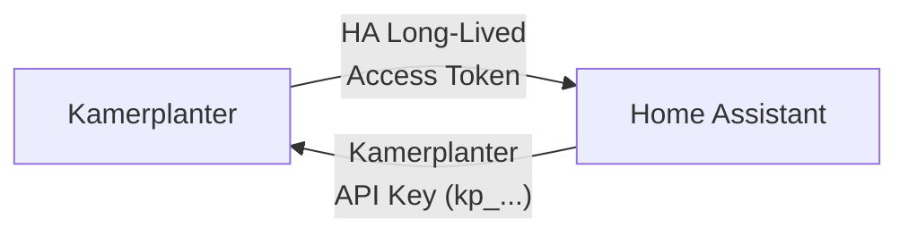

# Setup

!!! note "Before you start"
    This guide assumes two things:

    1. A running and reachable Kamerplanter backend instance.
    2. Network access from the Home Assistant host to the backend URL.

## Prerequisites: Bidirectional API Access

For a full integration, **both systems need mutual API access**:

```mermaid
flowchart LR
    KP["Kamerplanter"] -- "HA Long-Lived\nAccess Token" --> HA["Home Assistant"]
    HA -- "Kamerplanter\nAPI Key (kp_...)" --> KP
```

| Direction | Token | Purpose | Where to create |
|-----------|-------|---------|----------------|
| **HA → Kamerplanter** | Kamerplanter API key (`kp_` prefix) | HA reads plant data, tank values, tasks | Kamerplanter: **Settings** > **API Keys** |
| **Kamerplanter → HA** | HA Long-Lived Access Token | Kamerplanter reads sensor data, controls actuators | Home Assistant: **Profile** > **Long-Lived Access Tokens** |

!!! warning "Both tokens required"
    The HA integration needs the **Kamerplanter API key** to query data. Kamerplanter needs the **HA Access Token** to read sensor data from Home Assistant. It also uses this token to control actuators. For read-only use (HA dashboard only), the Kamerplanter API key alone is enough.

### Setting Up Tokens

=== "Kamerplanter API Key (HA → Kamerplanter)"

    1. In Kamerplanter: **Settings** > **API Keys** > **New Key**
    2. Copy the generated key (`kp_...`)
    3. In Home Assistant: Enter during the Kamerplanter integration config flow

=== "HA Access Token (Kamerplanter → HA)"

    1. In Home Assistant: **Profile** (bottom left) > **Long-Lived Access Tokens** > **Create Token**
    2. Copy the token
    3. In Kamerplanter: **Settings** > **Home Assistant** > Enter URL and token

---

## Config Flow

After installation, a 2-step wizard guides you through configuration:

### Step 1: Kamerplanter URL and API Key

Enter the URL of your Kamerplanter instance and the API key together:

| Example | URL |
|---------|-----|
| Local | `http://raspberry:8000` or `http://192.168.1.50:8000` |
| External | `https://kamerplanter.example.com` |

Enter the API key (`kp_` prefix) in the same step. In Light mode the key is optional.

!!! info "Automatic health check & mode detection"
    The integration automatically checks reachability via `/api/health`. It also detects whether the backend runs in Light or Full mode. There is no separate authentication step.

### Step 2: Select Tenant

For multi-tenant setups (for example community gardens), select the desired tenant from the list. For single users, HA skips this step.

---

## Reauthentication & Reconfigure

The integration supports two correction flows, accessible via **Settings** > **Integrations** > **Kamerplanter**:

=== "Reauthentication"

    When your API key has expired or been revoked, HA shows the integration as faulty. Click **Re-authenticate** and enter a new API key.

    !!! tip "When is reauth triggered?"
        HA automatically detects when the API responds with `401 Unauthorized` and triggers the reauthentication prompt.

=== "Reconfigure"

    Change the server URL, for example after moving the backend to a new address. Click **Configure** > **Change server URL**.

---

## Polling Intervals

Configurable under **Settings** > **Integrations** > **Kamerplanter** > **Configure**:

| Coordinator | Default | Minimum | Data |
|-------------|---------|---------|------|
| **Plant** | 300s | 120s | Plants, phases, dosages (also drives the Run coordinator) |
| **Location** | 300s | 120s | Locations, tanks, fill levels |
| **Alert** | 60s | 30s | Overdue tasks, sensor offline |
| **Task** | 300s | 120s | Pending tasks |
| **IPM** (Integrated Pest Management) | 120s | 60s | Pest pressure, waiting period, harvest safety |
| **Weather** | 1800s | 600s | Per-site frost forecast |

!!! tip "Faster alert polling"
    The Alert coordinator intentionally has a shorter default interval (60s) so time-critical notifications arrive faster.
