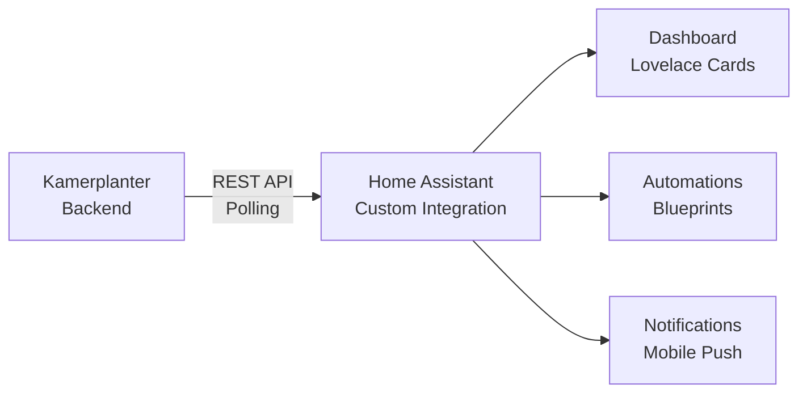

# Kamerplanter Home Assistant Integration

Kamerplanter integrates with Home Assistant via a **Custom Integration**. All plant data, tank values, tasks, and calendar entries appear as native HA entities and can be used in dashboards, automations, and notifications.

| Aspect | Details |
|--------|---------|
| **Repository** | [nolte/kamerplanter-ha](https://github.com/nolte/kamerplanter-ha) |
| **Installation** | HACS (Home Assistant Community Store) or manual |
| **Communication** | REST API polling against Kamerplanter backend |
| **Authentication** | API key (`kp_` prefix) or Light mode (no auth) |
| **Minimum HA version** | Home Assistant Core 2024.1+ |

## Features

- **Plant monitoring** — growth phases, days in phase, next phase predictions, nutrient plan assignments
- **Nutrient dosages** — per-channel mixing ratios (ml/L) as sensor attributes, ready for dashboard cards
- **Tank management** — fill events, solution age, EC/pH tracking via HA services
- **Location overview** — active runs and plant counts per tent, room, or bed
- **Task tracking** — todo list entity, overdue counts, calendar events for phases and tasks
- **Care reminders** — binary sensors for overdue care, events for actionable notifications
- **5 custom Lovelace cards** — plant, mix, tank, care, houseplant card (auto-registered)
- **Services** — fill tank, water channel, confirm care, refresh data, clear cache

## Next Steps

- [Installation](guides/installation.md) — Install via HACS or manually
- [Setup](guides/setup.md) — Config flow and token exchange
- [Entities](guides/entities.md) — All available sensors and entities
- [Automations](guides/automations.md) — Example automations and Jinja2 templates
- [Lovelace Cards](guides/lovelace-cards.md) — Configure custom cards
- [Services](guides/services.md) — HA services provided by the integration

## Kamerplanter Main Project

The HA integration is a standalone repository. Find the Kamerplanter backend and full documentation at:

- [Kamerplanter Documentation](https://nolte.github.io/kamerplanter/)
- [Kamerplanter Repository](https://github.com/nolte/kamerplanter)
